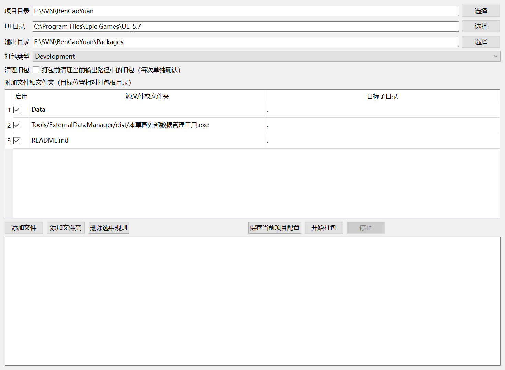

# UEPackageManager

通用 Unreal Engine 项目打包工具。提供图形界面与命令行双模式，调用 Unreal Automation Tool 完成 Build、Cook、Stage、Pak 和 Archive，并在成功后把指定文件或文件夹部署到包内。

## 下载与运行

从 [Releases](https://github.com/MZSH-Tools/UEPackageManager/releases/latest) 下载 `UEPackageManager.exe`。

- 双击EXE且不带参数：隐藏控制台并打开图形界面。
- 在终端中带子命令运行：保留控制台和CLI输出。
- 将EXE放在包含 `.uproject` 的项目根目录并双击；项目与关联引擎会自动识别，GUI中不可选择或修改。
- 从项目根目录的终端启动同样会自动识别；EXE放在其他目录时，GUI会拒绝打包并提示正确位置。
- 当前EXE未进行商业代码签名；Windows首次运行可能显示SmartScreen提示，可使用Release附带的SHA-256文件核对下载完整性。

## 图形界面



| 功能 | 作用 | 说明 |
|---|---|---|
| 项目 | 自动读取EXE或当前工作目录中的 `.uproject` | GUI只读，避免切换到其他项目 |
| UE目录 | 根据 `EngineAssociation` 自动检测 | GUI只读；源码引擎可通过CLI配置 |
| 输出目录 | 选择Archive输出位置 | 不允许直接使用项目根目录 |
| 打包类型 | `DebugGame`、`Development`、`Test` 或 `Shipping` | Shipping额外启用压缩 |
| 清理旧包 | 打包前清理当前输出路径中识别到的旧包 | 勾选状态随项目配置保存；每次实际清理仍需确认 |
| 附加文件 | 成功后复制文件或文件夹 | 可分别指定包内目标子目录和递归忽略项 |

附加复制仅在UE打包成功后执行。目录复制会跳过 `.trash`、`.svn`、`.git`、`.codex`、`.agents`、`.vs`、`.idea`、`__pycache__` 和 `.pyc`，复制后检查文件完整性。每条规则还可使用分号分隔的名称模式递归忽略任意层级中的文件或文件夹，支持 `*`、`?`，例如 `README*.md; Cache`。目标位置必须是包根目录内的相对目录，禁止绝对路径、盘符和 `..`；递归忽略项只填写名称模式，不能包含路径。

## 项目配置隔离

每个 `.uproject` 的配置根据其规范化绝对路径生成独立项目ID：

```text
%LOCALAPPDATA%/UEPackageManager/Projects/<项目ID>/config.json
```

项目路径、引擎目录、输出目录、打包类型和附加复制规则不会跨项目复用。GUI不读取“最近项目”，只绑定当前EXE或工作目录对应的项目；CLI无法从当前目录确定项目时必须显式传入 `--project-root`。

## CLI

```bat
UEPackageManager.exe --version
UEPackageManager.exe config-show --project-root E:\Projects\MyGame
UEPackageManager.exe configure --project-root E:\Projects\MyGame --configuration Shipping --output E:\Builds\MyGame
UEPackageManager.exe copy-list --project-root E:\Projects\MyGame
UEPackageManager.exe copy-add --project-root E:\Projects\MyGame --source E:\Assets\Data --target-directory . --ignore README*.md --ignore Cache
UEPackageManager.exe copy-remove --project-root E:\Projects\MyGame --index 0
UEPackageManager.exe validate --project-root E:\Projects\MyGame
UEPackageManager.exe package --project-root E:\Projects\MyGame --dry-run
UEPackageManager.exe package --project-root E:\Projects\MyGame
```

在项目根目录执行时，`--project-root` 可以省略。`--dry-run` 只输出UAT命令，不启动打包；`--no-copy` 可跳过附加文件部署；`--clean-output` 仅在本次打包前清理当前输出路径中识别到的旧包。切换输出路径后不会清理原来的路径。命令成功返回 `0`，参数、配置或执行错误返回 `2`。

## 源码运行

```bat
conda env create -f environment.yml
conda activate UEPackageManager
cd /d E:\Projects\MyGame
python E:\Tools\UEPackageManager\Main.py
python E:\Tools\UEPackageManager\Main.py validate --project-root E:\Projects\MyGame
```

Windows也可双击 `Run.bat` 启动GUI，或使用 `CLI.bat` 运行命令。

## 构建单文件EXE

```bat
Build.bat
```

构建只读取 `UEPackageManager.spec`，产物位于 `dist/UEPackageManager.exe`。该EXE保留CLI控制台，并在无参数GUI模式下自动隐藏控制台。

## 当前范围

- 支持Windows上的Win64项目打包。
- 支持 `DebugGame`、`Development`、`Test` 与 `Shipping`；不提供通常需要源码引擎的完整 `Debug`。
- 支持Epic Launcher引擎和手动指定的源码引擎。
- 不负责插件独立打包；插件发布请使用对应插件打包工具。
- 不自动关闭Unreal Editor，不删除项目或输出目录，不执行Git、SVN或Perforce操作。

## 许可证

[MIT License](LICENSE)
